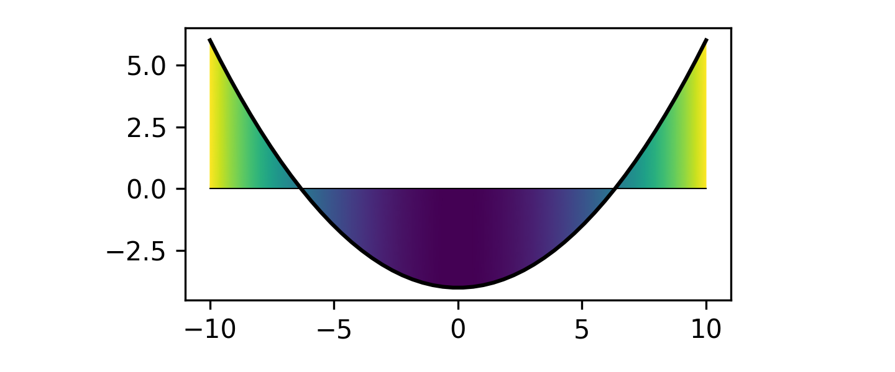

# mpl_fill_cmap_between

Create fill_between-like plots filled with any matplotlib's colormap.


## Examples

The function `fill_cmap_between` (and also the function `fill_cmap_between_x`) can be used in the following manner:

```python
import numpy as np
import matplotlib.pyplot as plt
from mpl_fill_cmap_between import fill_cmap_between

x = np.linspace(-10, 10, 100)
y = x**2 - 40

fig = plt.figure(figsize=(4.8, 2.0))
ax = fig.add_subplot(111)

fill_cmap_between(x, y, 0, ax=ax, cmap="viridis")

fig.tight_layout()
fig.savefig("example.png", dpi=300)
```



